# The Mah-Jong Set

A Mah-Jong set consists of 144 tiles and two six-sided dice.

## The Suit Tiles

Tiles numbered "1" to "9" in the suits of **Characters**, **Bamboos**, and **Circles** (four of each).

**Circles**:  

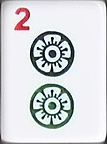

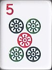

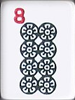

**Bamboos**:  

  
Note that 1 Bamboos is always a bird.

**Characters**:  

## The Honour Tiles

Four **Winds**, East, South, West, and North (four of each):  

Three **Dragons**, Red, Green, and White (four of each):  

## Bonus Tiles

Four **Flower** tiles and four **Season** tiles:  
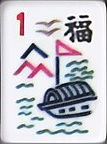
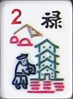
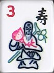
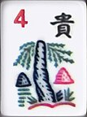  
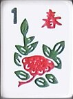
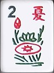
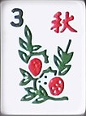
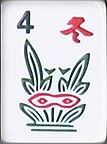  
The numbers on the bonus tiles correspond to the players’ Winds: 1 is East, 2 is South, 3 is West, and 4 is North (as per the standard order).
