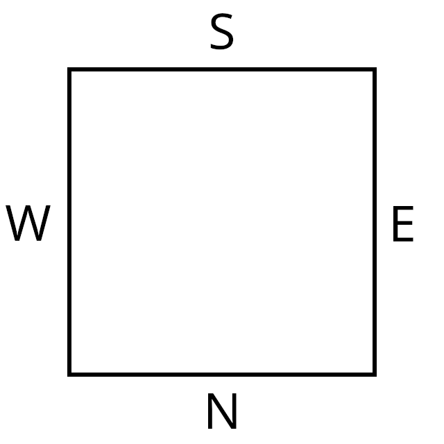
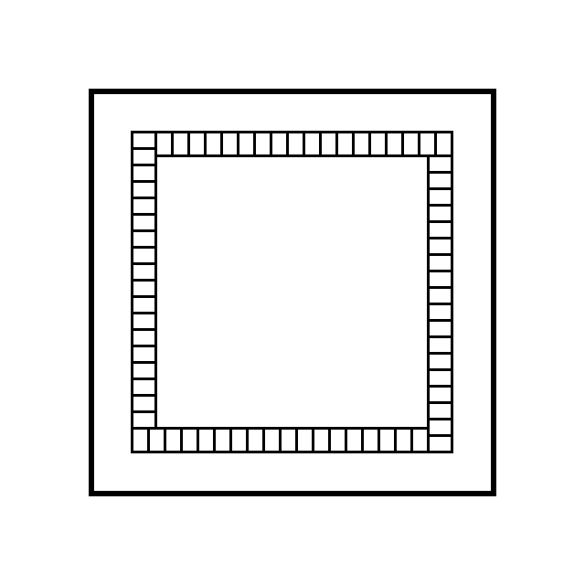
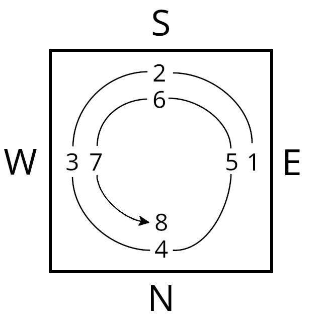
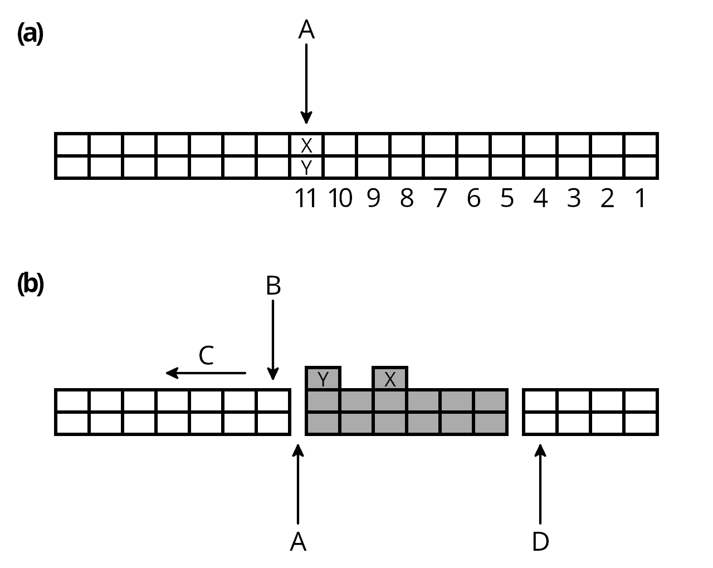

# Preparing for a Game

## Assigning Seats/Winds

Mah-Jong is played around a four-sided table representing the four Winds:

The order (East, South, West, North) follows the convention used by Eastern navigators, not Westerners.

You must assign an initial Wind/seat allocation. You may do this in any way you wish. Here are two suggestions:

- The usual method is to take one of each of the four Wind tiles, place them face down, shuffle them, and have each player draw a tile. The players then take seats relative to each other as shown in the diagram above.
- The players roll a die (or two), and the player with the highest roll becomes the East Wind. The other players, in a counterclockwise direction, become South, West, and North.

This is only an initial Wind allocation. The Winds will rotate throughout the game.

## Making the Wall

All the tiles are placed face down on the table and shuffled. Each player then selects random tiles and arranges them two tiles high in an 18-tile line. Connect each player's line to form a square, called the "wall."

## Breaking the Wall

The East Wind player throws two dice. The roll determines which player's line will be broken, counting counterclockwise starting with the East Wind player. The diagram below shows an example when the two dice total eight.

The player indicated by the roll then rolls the two dice again and adds the new result to the previous roll. The new total determines where the wall will be broken, counting from the indicated player's rightmost tile (the diagram below shows the case where the second roll was three, resulting in a sum of 11). Break the wall by taking the two tiles at the indicated position and placing them to the player's right, as shown:

The point from which the tiles are taken is called the "break" (A), and the tiles are known as the "loose tiles" (X and Y). The "open end" of the wall begins to the player's left of the break (B), and tiles will be drawn in the clockwise direction of the break (C). The 14 tiles in the counterclockwise direction of the break (including the two loose tiles on top) are the "kong box" (grey tiles). Create a second, small gap after six stacks (6x2 tiles plus the two loose tiles) of the kong box to the player's right to make the separation between the end of the wall (D) and the kong box.

## The Kong Box (Dead Wall)

The kong box's purpose is to provide replacement tiles for Flower, Season, and kong draws. When taking replacements, first take the loose tile farther from the break (X), then the loose tile closer to the break (Y).

When the two loose tiles are gone, you may replace them with the next stack from the break's side (provided there is still space on top of the kong box). If you do, draw the loose tiles in the same way as before. If you do not replace the loose tiles, when a supplemental tile is needed, draw a tile from the kong box (from the break's side), just as you draw tiles from the wall.

The kong box is not replenished, which means that there are at most 14 supplemental tiles, and the kong box can be exhausted. Do not move tiles from the wall to the kong box as supplemental tiles are taken. If the kong box is exhausted and a supplemental tile is required, the hand ends in a draw.

## Dealing the Tiles

The East Wind player starts the deal by taking the first two stacks of tiles (i.e., four tiles) from the open end of the wall, followed by each of the other three players taking two stacks of tiles in the order South, West, and North (the counterclockwise order of play), consuming the wall in the clockwise direction. This is repeated until each player has twelve tiles. Then each player draws one tile, bringing their hands to thirteen tiles. The East Wind player then draws a fourteenth tile.

## Bonus Tile Replacements

If any bonus tiles (Flower and/or Season tiles) have been drawn during the deal, the players in turn (starting with East) expose them face up in front of themselves and draw replacements from the kong box. If another bonus tile is drawn, it is also immediately exposed and replaced until that player holds no more bonus tiles. The next player then replaces their tiles if needed. Declaring Mah-Jong must wait until all players have replaced all their bonus tiles.
