# Special Hands

The list below comprises the 19 special patterns recognised by the BMJA, as described in "Mah-Jong (Know the Game)" by Gwyn Headley and Yvonne Seeley. You may use it as a starting point and add or remove patterns as you wish, or you may prefer to use an entirely different list altogether.

## Non-Limit Hands

### Purity

- Win: 3 doubles
- Fishing: 3 doubles

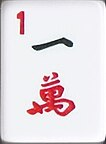

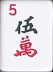

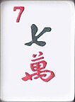

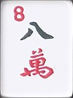

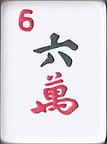

Four pungs or kongs and a pair in any one suit. No Wind, Dragon, or chow sets.

## Half-Limit Hands

### Triple Knitting

- Win: 50% limit
- Fishing: 20% limit

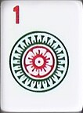
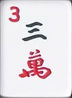
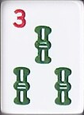
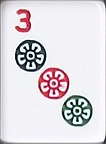

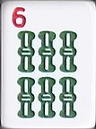
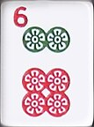

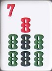
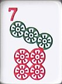
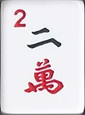
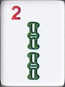

Four knitted pungs (each comprising one tile from every suit of the same number) and a knitted pair comprising two tiles in different suits of the same number. No honour tiles.

### Knitting

- Win: 50% limit
- Fishing: 20% limit

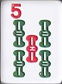

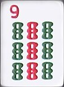
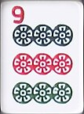

Seven pairs of tiles, each pair comprising two suits. No honour tiles.

### All Pair Honours

- Win: 50% limit
- Fishing: 20% limit

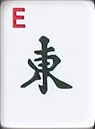

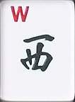

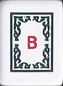

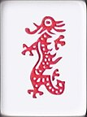

A hand of pairs composed only of terminals, Wind, and/or Dragon tiles. Ones and nines are allowed despite the name (which is the traditional name). Duplicate doubles are allowed, provided they have not been declared as a kong.

## Limit Hands

### Buried Treasure

- Win: 100% limit
- Fishing: 40% limit

A hand consisting of four concealed pungs (no kongs) and a pair, formed from a single suit and/or honours. For all four pungs to be considered concealed, each must be self-drawn; they cannot be completed with a discard when declaring Mah-Jong, as that would expose the pung. The pair may be completed with a discard claimed by declaring Mah-Jong.

### Fourfold Plenty

- Win: 100% limit
- Fishing: 40% limit

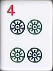

Four kongs and a pair.

### Heads and Tails

- Win: 100% limit
- Fishing: 40% limit

A hand composed solely of terminals (1s and 9s).

### The Gates of Heaven

- Win: 100% limit
- Fishing: 40% limit

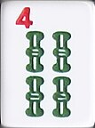

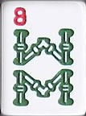

A hand consisting of 1-1-1-2-3-4-5-6-7-8-9-9-9 in a single suit and any other tile of that suit. The two pungs must be concealed.

### The Wriggling Snake

- Win: 100% limit
- Fishing: 40% limit

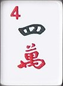

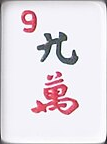

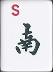

A pair of 1s (snake’s eyes) and a run from 2 through 9, all in the same suit, plus one of each Wind.

### All Winds and Dragons

- Win: 100% limit
- Fishing: 40% limit

A standard winning hand composed exclusively of honour tiles.

### Imperial Jade

- Win: 100% limit
- Fishing: 40% limit

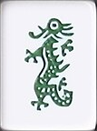

A standard winning hand consisting solely of Green Dragons or the 2, 3, 4, 6, or 8 of bamboo. The other tiles (1, 5, 7, and 9) typically have red paint on them and therefore are not entirely green. Chows are not allowed.

### The 13 Unique Wonders

- Win: 100% limit
- Fishing: 40% limit

One tile of each Dragon, one tile of each Wind, a 1 and a 9 from each suit, and any additional tile that matches another in the hand to form a pair.

### Three Great Scholars

- Win: 100% limit
- Fishing: 40% limit

A pung or kong of each type of Dragon tile, another pung or kong of any suit, and any pair.

### Four Blessings Hovering over the Door

- Win: 100% limit
- Fishing: 40% limit

A pung or kong of each type of Wind tile, plus any pair.

### Heaven's Blessing

- Win: 100% limit
- Fishing: N/A

When the East Wind’s initial 14 tiles form a complete, valid winning hand.

### Earth's Blessing

- Win: 100% limit
- Fishing: N/A

When the South, West, or North Wind completes a valid winning hand on the dealer's first discard.

### Gathering the Plum Blossom from the Roof

- Win: 100% limit
- Fishing: N/A

Win with a supplemental tile when the tile is 5 Circles.

### Plucking the Moon from the Bottom of the Sea

- Win: 100% limit
- Fishing: N/A

Win with the last tile from the wall when the tile is 1 Circles.

### Twofold Fortune

- Win: 100% limit
- Fishing: N/A

When a player declares a kong, uses the supplemental tile to complete a second kong, and then, with the second kong’s supplemental tile, declares Mah-Jong.
